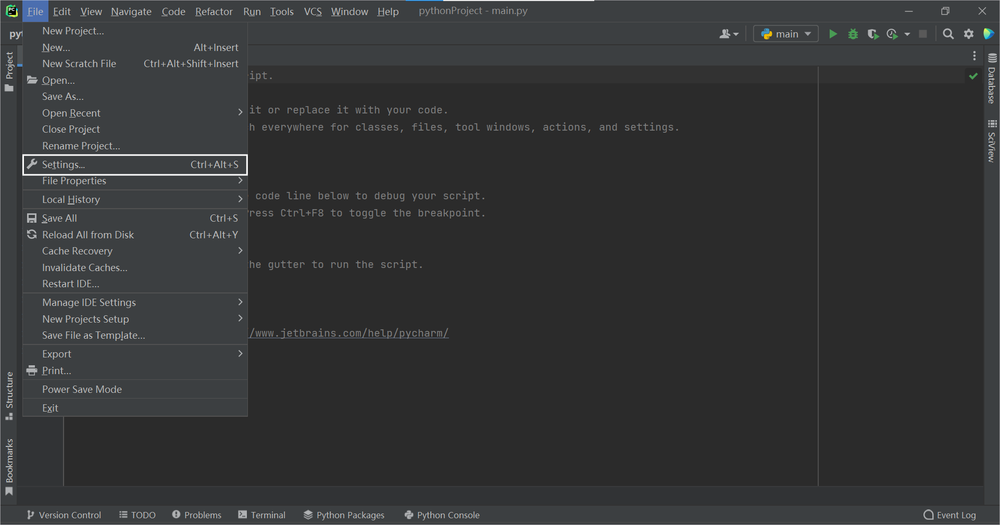
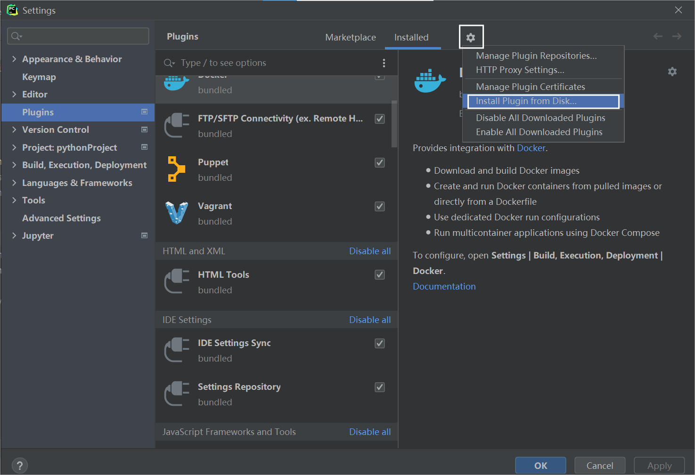

SummarY是一个应用于PyCharm的智能化代码注释生成插件

## 安装
1.获取`SummarY-1.0-SNAPSHOT.zip`

2.打开PyCharm，选择
- Windows：`File` -> `Settings` -> `Plugins`;

- Mac：`IntelliJ IDEA` -> `Preferences` -> `Plugins`;

3.选择 `Install Plugin from Disk`

4.找到zip文件，并将其导入

5.重启PyCharm以激活插件

## 使用
1.在PyCharm中打开项目后，选择你想要为其生成注释的目标函数

2.将光标移动至函数体内，使用快捷键`Shift + C` 或右键选择`Generate->generate comment`

3.确认生成注释后会启动插件，等待片刻后会跳出侧边栏界面，上方显示了插件生成的注释结果

## 源码使用

### 环境配置
1.下载源码后，打开Intellij IDEA导入项目，选择`File` -> `Project Structure`

2.在`Project Settings` -> `Project`页面
- 配置SDK为IntelliJ Platform Plugin SDK，若本地没有可点击`Add SDK`下载，选择对应JDK11的版本
- 配置语言级别为11

### 插件编译
1. 使用gradle构建项目

2. 点击右侧侧边栏的Gradle，选择`Tasks` -> `intellij` -> `buildPlugin`

3. 在`build/distributions`文件夹下找到`SummarY-1.0-SNAPSHOT.zip`

